# GameJams

## 2018

### Ludum Dare 41 - Theme: Combine 2 Incompatible Genres (48 hours)

https://kayzgames.github.io/ld41/

### One hour game jam 143- Theme: Moon (1 hour)

https://kayzgames.github.io/ohgj_143/

### One hour game jam 142 - Theme: Submerged (1 hour)

https://kayzgames.github.io/ohgj_142/

## 2017

### Ludum Dare 38 - Theme: A Small World (48 hours)

https://kayzgames.github.io/ld38/

## 2016

### Ludum Dare 36 - Theme: Ancient Technology (48 hours)
[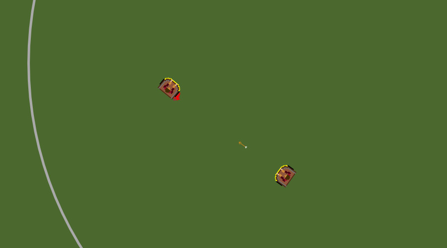](https://kayzgames.github.io/ld36/)

### Ludum Dare 35 - Theme: Shapeshift (48 hours)
[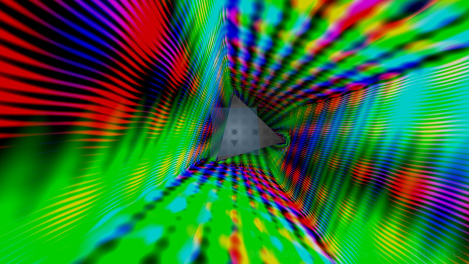](https://isowosi.github.io/shapeocalypse/)

## 2015

### Ludum Dare 34 - Theme: Two Button Controls, Growing (48 hours)
[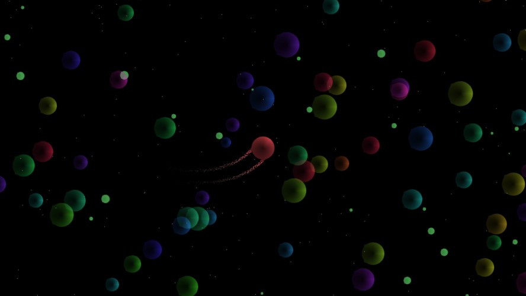](https://kayzgames.itch.io/damacreat)

### Ludum Dare 33 - Theme: You are the Monster (48 hours)
[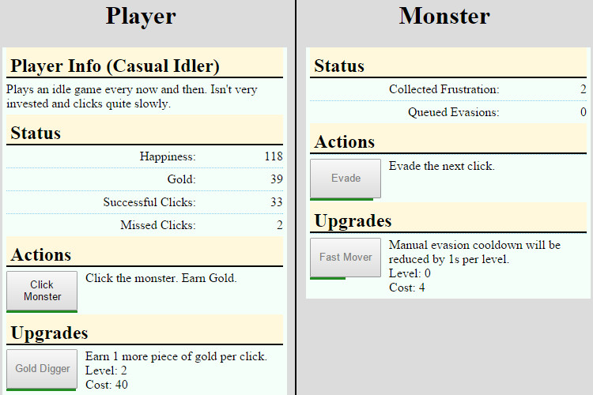](http://kayzgames.github.io/ld33/)

### ZFX Action 7 - Theme: An indie game where you swap towers while bards write songs about you. (48 hours)
[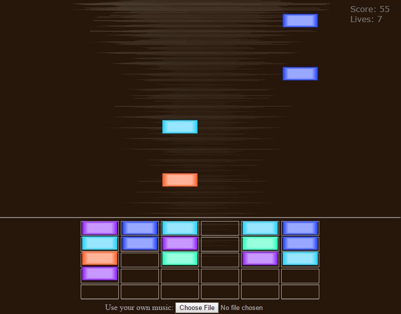](http://kayzgames.github.io/zfx_action_7/)

### Mini LD 57 - Theme: Reversed (1 week)
[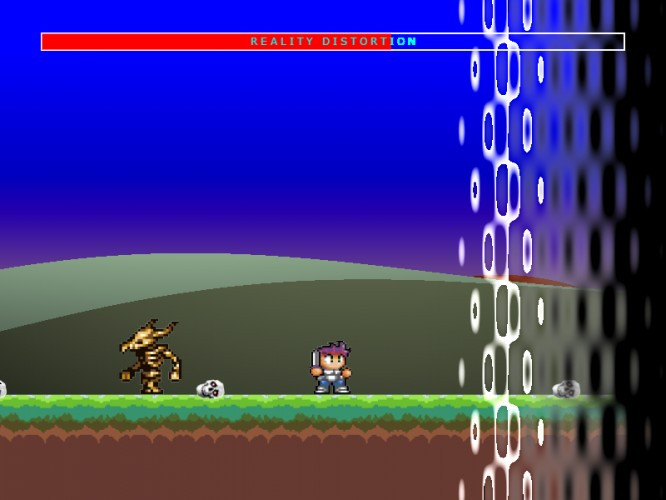](http://kayzgames.github.io/minild57/)

### ZFX Action 6 - Theme: An arcade game where you avoid triangles with your friends (48 hours)
[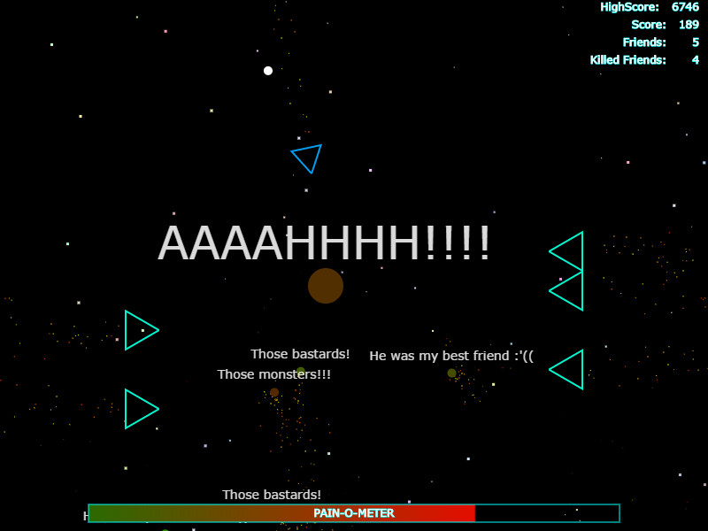](http://kayzgames.github.io/zfx_action_6/) 

## 2014

### Ludum Dare 30 - Theme: Connected Worlds (48 hours)
[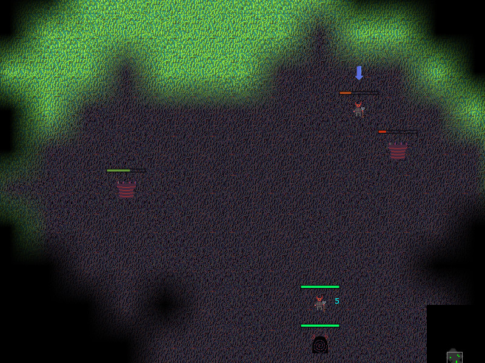](http://denniskaselow.github.io/ld30/pc/)

### Ludum Dare 29 - Theme: Beneath The Surface (48 hours)
[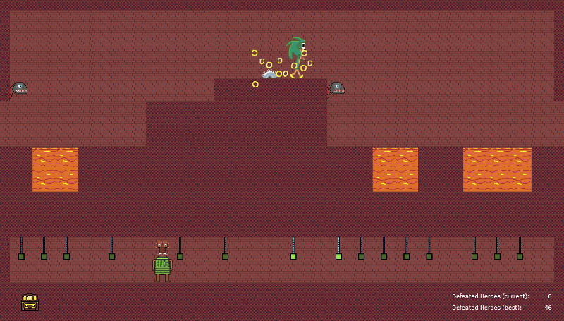](http://denniskaselow.github.io/ld29_beneath_the_surface/pc/)

### 3 Hour Game Jam - Theme: Banana (3 hours)
[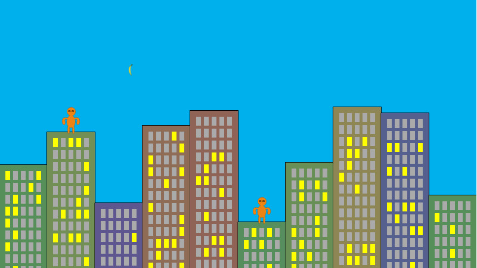](https://denniskaselow.github.io/3hgj_banana/3hgj_banana.html)

### 3 Hour Game Jam - Theme: Witch (3 hours)
[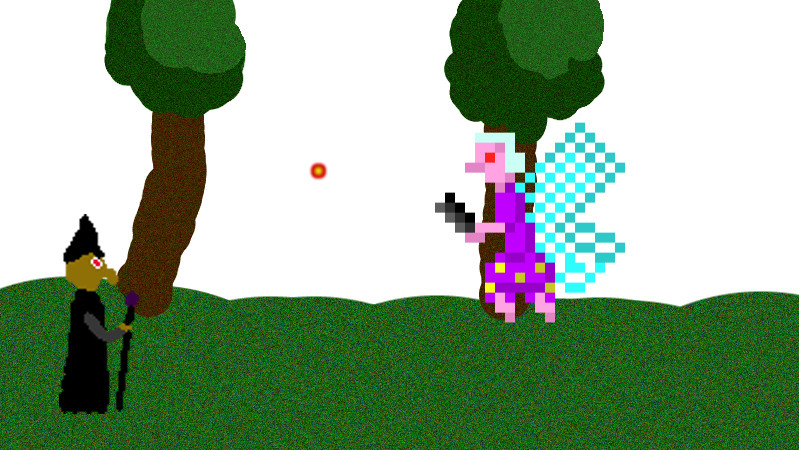](https://denniskaselow.github.io/3hgj_witch/3hgj_witch.html)

## 2013

### Ludum Dare 28 - Theme: You've Only Got One (48 hours)
[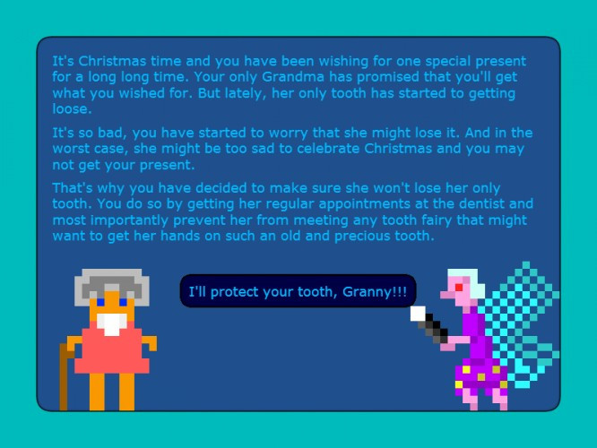](http://kayzgames.github.io/ld28/)

### Ludum Dare 28 WarmUp (48 hours)
[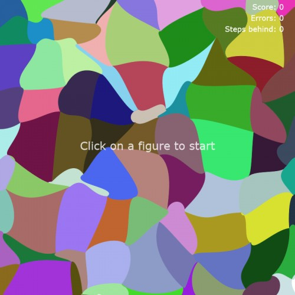](http://kayzgames.github.io/ld28_warmup/ld28_warmup.html)

### Ludum Dare 27 - Theme: 10 Seconds (48 hours)
[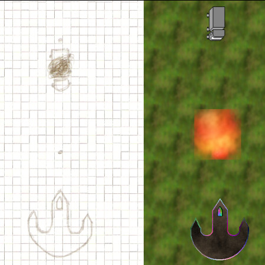](http://kayzgames.github.io/ld27/ld27.html)

### Ludum Dare 26 - Theme: Minimalism (48 hours)
[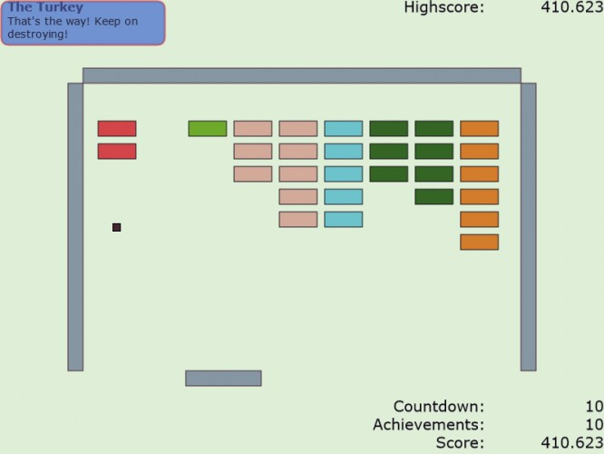](http://kayzgames.github.io/ld26_minimalism/ld26_minimalism.html)

### Ludum Dare 26 WarmUp (48 hours)
[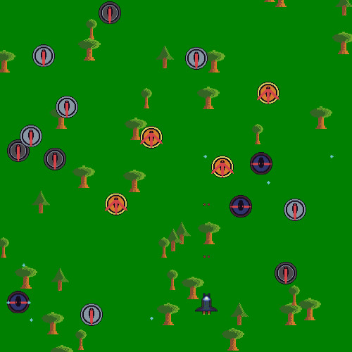](http://kayzgames.github.io/ld26_warmup/ld26_warmup.html)

## 2012

### November 2012 - Github GameOff 2012 (1 month)
[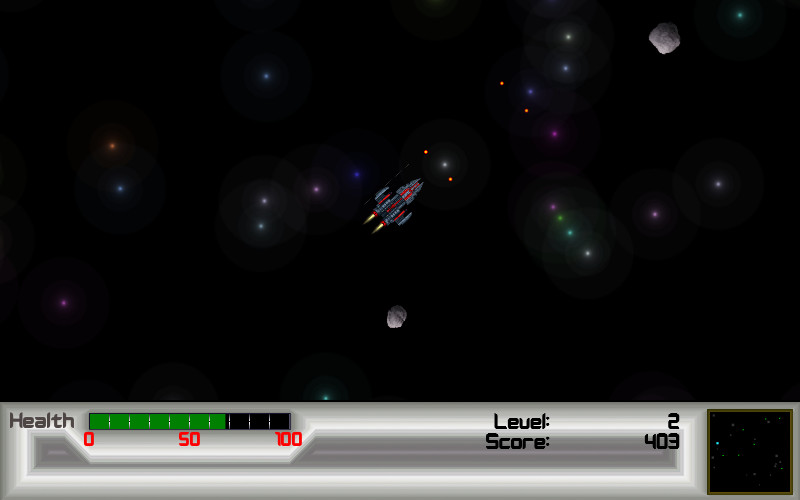](http://denniskaselow.github.io/game-off-2012/spaceoff.html)
